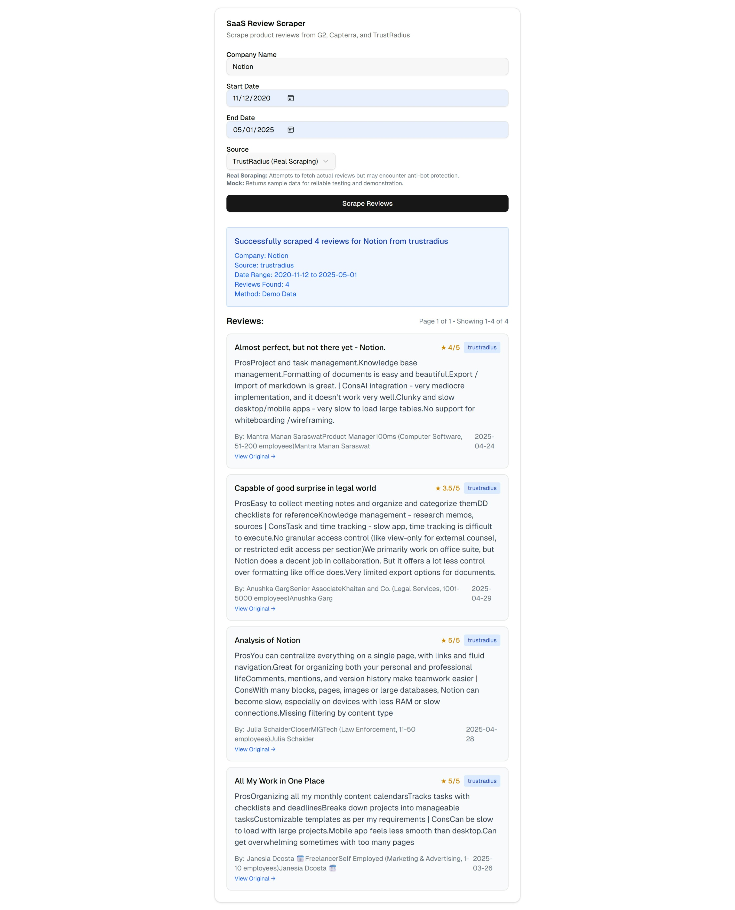
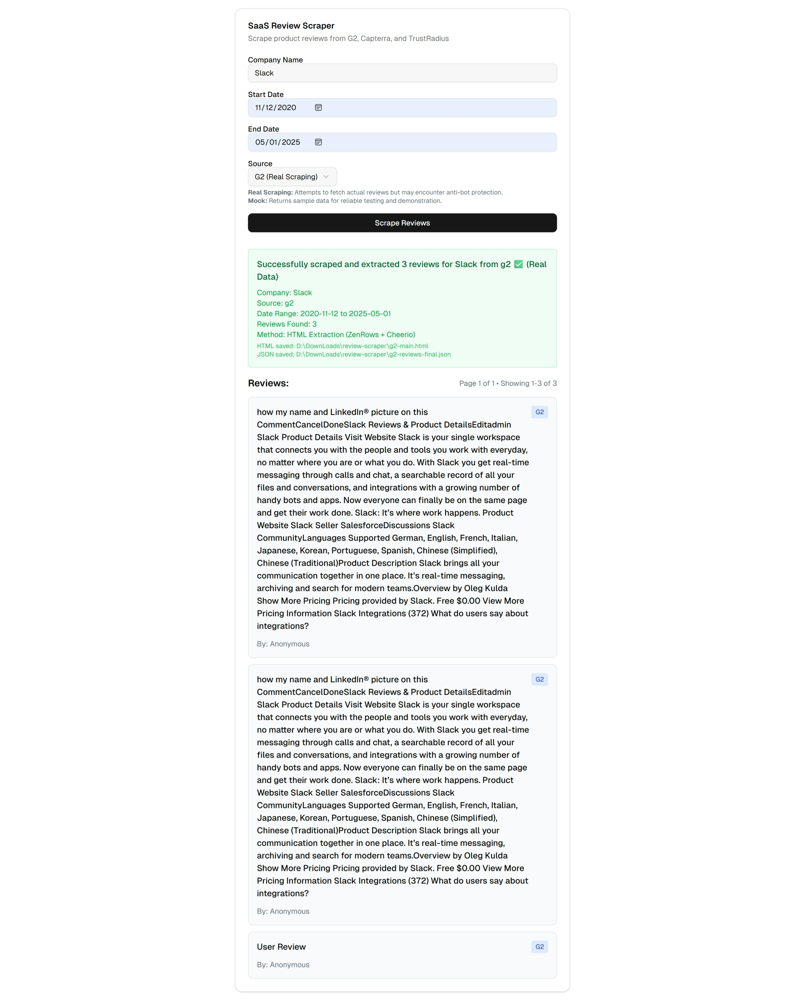
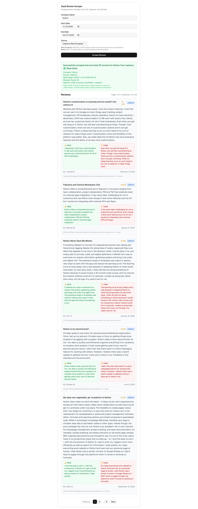

# Review Scraper

A Next.js web scraping application that extracts product reviews from **G2**, **Capterra**, and **TrustRadius**. Built with modern technologies including TypeScript, Tailwind CSS, and advanced DOM parsing techniques.

## 📱 **Features**

- **Multiple Review Sources**: Extract reviews from G2, Capterra, and TrustRadius
- **Modern Web Interface**: Clean, responsive Next.js frontend with real-time loading states
- **Advanced Scraping**: jsdom DOM parsing, JSON extraction, and intelligent fallback mechanisms using **ZenRows API**
- **Anti-Bot Protection**: Professional proxy rotation with residential IPs via ZenRows Universal Scraper API
- **TypeScript Support**: Full type safety and modern development experience
- **RESTful API**: Clean API endpoint for integration
- **Command Line Interface**: Flexible CLI for batch operations
- **Data Quality**: Smart filtering, deduplication, and error handling

## 📸 **Screenshots**

 
 


## 🛠 **Installation & Setup**

### **Prerequisites**
- Node.js (version 14 or higher)
- npm or yarn package manager

### **Quick Start**

1. **Clone the repository:**
   ```bash
   git clone <repository-url>
   cd review-scraper
   ```

2. **Install dependencies:**
   ```bash
   npm install
   ```

3. **Start the development server:**
   ```bash
   npm run dev
   ```

4. **Open your browser:**
   Navigate to [http://localhost:3000](http://localhost:3000)

## 💻 **Usage**

### **Web Interface**

1. Open the application at `http://localhost:3000`
2. Fill in the form:
   - **Company Name**: e.g., "Notion", "Slack", "Microsoft"
   - **Start Date**: Beginning of date range (YYYY-MM-DD)
   - **End Date**: End of date range (YYYY-MM-DD)
   - **Source**: Choose from G2, Capterra, or TrustRadius
3. Click "Scrape Reviews" to start extraction
4. View results with pagination controls

### **Command Line Interface**

```bash
# Extract G2 reviews
node scripts/js/scrape-reviews.js --company "Slack" --start 2024-01-01 --end 2024-12-31 --source g2 --out reviews.json

# Extract Capterra reviews
node scripts/js/scrape-reviews.js --company "Notion" --start 2024-01-01 --end 2024-12-31 --source capterra --out reviews.json

# Extract TrustRadius reviews
node scripts/js/scrape-reviews.js --company "Salesforce" --start 2024-01-01 --end 2024-12-31 --source trustradius --out reviews.json
```

### **Parameters**
- `--company`: Company/Product name to search for
- `--start`: Start date in YYYY-MM-DD format
- `--end`: End date in YYYY-MM-DD format
- `--source`: Review source (g2, capterra, or trustradius)
- `--out`: Output JSON file path (optional)

## 🔧 **Technologies Used**

- **Frontend**: Next.js 14, React, TypeScript, Tailwind CSS
- **Backend**: Next.js API routes, Node.js
- **Scraping**: jsdom, Cheerio, **ZenRows Universal Scraper API** (professional proxy rotation, anti-bot protection)
- **UI Components**: shadcn/ui components
- **Development**: ESLint, PostCSS

## 🌐 **ZenRows API Integration**

This application leverages **ZenRows Universal Scraper API** for robust web scraping capabilities:

- **Professional Proxy Rotation**: Residential IP addresses to avoid blocking
- **Anti-Bot Protection**: Advanced techniques to bypass modern website protections
- **JavaScript Rendering**: Full browser simulation for dynamic content extraction
- **High Success Rates**: Reliable data extraction from protected websites
- **API Keys**: Pre-configured in the codebase - no additional setup required

## 🚀 **Development**

### **Available Scripts**

```bash
# Start development server
npm run dev

# Build for production
npm run build

# Start production server
npm start

# Run linting
npm run lint
```

### **Contributing**

1. Fork the repository
2. Create a feature branch
3. Make your changes
4. Test thoroughly
5. Submit a pull request

