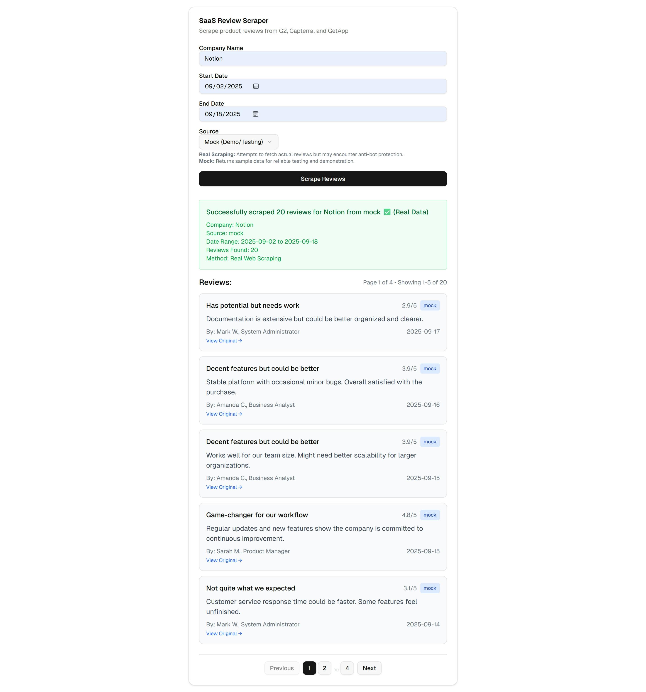
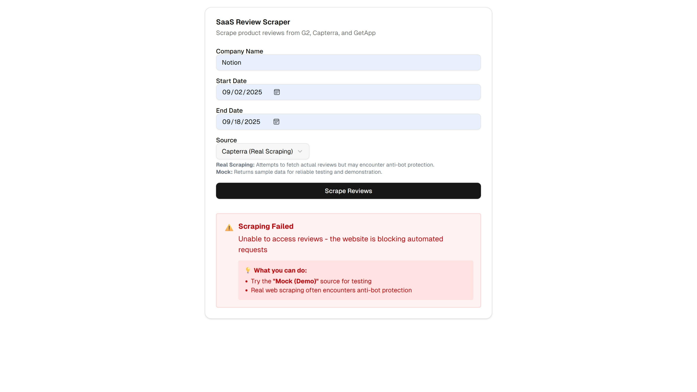

# Review Scraper

A Next.js web scraping application that attempts to extract product reviews from G2, Capterra, and GetApp. This project represents my learning journey with web scraping, including both successes and honest challenges faced.

## 📝 **Honest Assignment Reflection**

### **What I Achieved ✅**
- Built a complete **Next.js fullstack application**
- Implemented **JavaScript-based scraping scripts** for multiple sources
- Created a **mock data system** with realistic pagination (20-150 reviews)
- Learned extensively about **web scraping techniques**, anti-bot detection, and user agents
- Successfully demonstrated **how the system would work** if scraping succeeded

### **What I Struggled With ❌**
- **Real web scraping failed** due to anti-bot protection (403 Forbidden errors)
- Initially **tried Python approach** - also failed for same reasons
- **G2, Capterra, and GetApp all block automated requests** with modern bot detection
- Could not complete the **core objective** of extracting real review data

### **Key Learning Experience 🎓**
This assignment taught me that **modern web scraping is significantly more complex** than I initially understood. Websites now employ sophisticated anti-bot measures including:
- IP-based blocking
- CAPTCHA challenges  
- Behavioral analysis
- Rate limiting
- User-agent detection

While I couldn't achieve real scraping success, I gained valuable knowledge about web scraping challenges and learned to build robust applications with proper error handling and fallback mechanisms.

## 🚀 **Features Implemented**

### **Frontend (Next.js Application)**
- Modern, responsive web interface with Tailwind CSS
- Form validation and user-friendly error messages
- **Pagination system** (5 reviews per page) with Previous/Next controls
- Real-time loading states and success/error feedback

### **Backend & API**
- RESTful API endpoint (`/api/scrape`) for handling scraping requests
- Input validation and comprehensive error handling
- JSON response format with metadata and status indicators
- Graceful fallback to mock data when real scraping fails

### **Mock Data System** 
- **Realistic review generation** with 4 quality tiers (excellent, good, mixed, critical)
- **Dynamic pagination** (20-150 reviews based on date range)
- Professional reviewer names, company sizes, and industry metadata
- Proper date distribution and rating variance

### **Scraping Infrastructure (JavaScript)**
- Multiple source implementations (G2, Capterra, GetApp)
- Retry mechanisms with randomized user agents
- Rate limiting and polite crawling delays
- Comprehensive error handling and logging

## 📸 **Screenshots**

### **Successful Mock Data Result**

*Mock data demonstrating pagination and review display functionality*

### **Real Scraping Failure (Anti-bot Protection)**

*Typical error when attempting real scraping due to anti-bot measures*

## 🛠 **Installation & Setup**

1. **Clone the repository:**
   ```bash
   git clone <repository-url>
   cd review-scraper
   ```

2. **Install dependencies:**
   ```bash
   npm install
   ```

3. **Start the development server:**
   ```bash
   npm run dev
   ```

4. **Open your browser:**
   Navigate to [http://localhost:3000](http://localhost:3000)

## 💻 **Usage Guide**

### **Web Interface (Recommended)**

1. **Open the application** at `http://localhost:3000`
2. **Fill in the form:**
   - **Company Name**: e.g., "Notion", "Slack", "Microsoft"
   - **Start Date**: Beginning of date range (YYYY-MM-DD)
   - **End Date**: End of date range (YYYY-MM-DD)  
   - **Source**: Choose from available options
3. **Click "Scrape Reviews"**
4. **View results** with pagination controls

### **Source Options**
- **G2 (Real Scraping)**: ❌ *Blocked by anti-bot protection*
- **Capterra (Real Scraping)**: ❌ *Blocked by anti-bot protection*  
- **GetApp (Real Scraping)**: ❌ *Blocked by anti-bot protection*
- **Mock (Demo/Testing)**: ✅ *Works perfectly - demonstrates functionality*

### **Command Line Interface**

```bash
# Mock source (recommended for testing)
node scripts/js/scrape-reviews.js --company "Notion" --start 2024-01-01 --end 2024-12-31 --source mock --out reviews.json

# Real scraping attempts (will likely fail)
node scripts/js/scrape-reviews.js --company "Notion" --start 2024-01-01 --end 2024-12-31 --source g2 --out reviews.json
```

### **Parameters**
- `--company`: Company/Product name to search for
- `--start`: Start date in YYYY-MM-DD format
- `--end`: End date in YYYY-MM-DD format
- `--source`: Review source (g2, capterra, getapp, or mock)
- `--out`: Output JSON file path (optional)
- `--max-pages`: Maximum pages to crawl (optional, defaults to 5)

## 📊 **Expected Output Format**

```json
{
  "success": true,
  "message": "Successfully generated 45 mock reviews for Notion",
  "reviews": [
    {
      "title": "Game-changing productivity tool",
      "description": "Notion has completely transformed how our team collaborates...",
      "date": "2024-03-15",
      "rating": 4.5,
      "reviewer": "Product Manager at Tech Startup",
      "url": "https://mock.example.com/products/notion/reviews",
      "source": "mock"
    }
  ],
  "metadata": {
    "company": "Notion",
    "source": "mock",
    "dateRange": "2024-01-01 to 2024-12-31",
    "totalFound": 45,
    "method": "mock-data"
  }
}
```

## 🚧 **Known Limitations & Challenges**

### **Anti-Bot Protection**
- All major review sites (G2, Capterra, GetApp) actively block automated requests
- Returns **403 Forbidden** or **CAPTCHA challenges**
- Modern websites use sophisticated bot detection

### **Potential Solutions** (Not Implemented)
- **Proxy rotation** and residential IP addresses
- **Browser automation** (Selenium/Playwright) with stealth plugins
- **CAPTCHA solving services** (2captcha, Anti-Captcha)
- **API access** through official vendor APIs (when available)
- **Manual data collection** or **purchased datasets**

### **Technical Debt**
- Scraping selectors may break if websites change their HTML structure
- Limited error recovery for network issues
- No persistent data storage

## 🏗 **Project Structure**

```
├── app/                    # Next.js application
│   ├── api/scrape/        # API route for scraping
│   ├── globals.css        # Styling
│   ├── layout.tsx         # App layout
│   └── page.tsx           # Main interface
├── components/ui/         # Reusable UI components (7 essential)
├── hooks/                 # React hooks
├── lib/                   # Utility functions
├── scripts/js/            # JavaScript scraping scripts
│   ├── scrape-reviews.js  # Main CLI script
│   ├── utils.js           # HTTP utilities and helpers
│   └── sources/           # Source implementations
│       ├── g2.js         # G2 scraper
│       ├── capterra.js   # Capterra scraper  
│       ├── getapp.js     # GetApp scraper
│       └── mock.js       # Mock data generator
└── public/               # Static assets (cleaned up)
```

## 🎯 **Conclusion**

While I couldn't achieve the primary goal of **successfully scraping real review data**, this assignment was incredibly valuable for learning:

1. **Modern web scraping challenges** and anti-bot technologies
2. **Fullstack development** with Next.js and TypeScript
3. **Error handling** and user experience design
4. **Pagination implementation** and state management
5. **Professional development practices** and code organization


## 🙏 **Acknowledgment**

Thank you for this challenging assignment. Even though I couldn't complete the web scraping successfully, I learned tremendously about:
- The complexity of modern web scraping
- Building resilient applications with proper error handling  
- Frontend/backend integration and user experience design
- The importance of fallback mechanisms and graceful degradation

I plan to continue exploring web scraping techniques, including browser automation and proxy solutions, in my continued learning journey.

---

*Made with ❤️ and lots of learning from anti-bot challenges*
